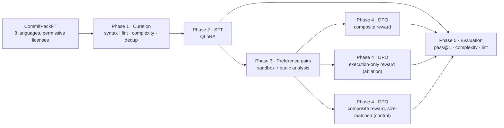

# CodeAlign

Post-training pipeline for a coding LLM (SFT → DPO) whose preference pairs are labelled automatically by a sandbox and static analysis, not by humans. The question it tests: does a reward that combines execution with code-quality signals (cyclomatic complexity, lint) produce cleaner code than an execution-only reward, without losing correctness?

**Base model:** `Qwen2.5-Coder-7B-Instruct` · **Data:** CommitPackFT, 8 languages · **Training:** QLoRA SFT + DPO (TRL, PEFT) on one consumer GPU · **Sandbox:** Docker via a Rust gRPC daemon · **Evaluation:** HumanEval pass@1 + cyclomatic complexity + lint

## Project context

CodeAlign is a practical demonstration of the JetBrains internship *Post-Training Coding LLMs with Frontier Alignment Methods*. Built to bridge my initial lack of hands-on experience, it is a complete, end-to-end post-training pipeline. The project is specifically tailored to the JetBrains ecosystem: it supports eight programming languages that mirror their IDE lineup, and it utilizes reward signals that an IDE already naturally computes, such as execution success, code complexity, and linter feedback.

### Hypothesis

When the only reward is "the code runs / passes", the model has no reason to prefer the simpler of two working solutions. Optimising against a binary execution signal is a form of reward hacking: the model can learn to produce needlessly complex, hard-to-maintain code that still satisfies the check. CodeAlign tests whether adding static-analysis terms to the reward prevents that:

$$R_{\text{total}} = w_1 R_{\text{exec}} + w_2 R_{\text{static}} + w_3 R_{\text{style}}$$

| Component | Signal | Weight | Purpose |
|---|---|---|---|
| $R_{\text{exec}}$ | Binary: the candidate executes in the sandbox without errors | `w₁ = 1.0` | Functional signal |
| $R_{\text{static}}$ | Negative, proportional to cyclomatic complexity | `w₂ = 0.1` | Simplicity |
| $R_{\text{style}}$ | Penalty per lint violation (per-language linters) | `w₃ = 0.2` | Idiomatic, bug-free style |

`R_exec` means *executes without runtime errors in an isolated container*, not *passes unit tests*: the curated prompts come from real commits and have no test suites. Correctness against tests is measured only at evaluation time, on HumanEval.



---

## Results (v1.0)

| Model | HumanEval pass@1 (95% CI) | Mean CC | Mean lint errors | Parse failures |
|---|---|---|---|---|
| Base (`Qwen2.5-Coder-7B-Instruct`) | **90.2%** [84.7, 93.9] | 3.70 | 0.13 | 0% |
| SFT | 70.7% [63.4, 77.2] | 3.54 | 0.05 | 0% |
| DPO, execution-only reward (3,267 pairs) | 53.0% [45.4, 60.5] | 3.28 | 2.79¹ | 0% |
| DPO, composite reward, size-matched (3,267 pairs) | 45.1% [37.7, 52.8] | 2.03 | 0.07 | 0% |
| DPO, composite reward (30,628 pairs) | 24.4% [18.5, 31.5] | 1.42 | 0.25 | 0% |

¹ One generation (HumanEval/162) has 456 lint violations; every other execution-only generation has at most 1. The median is 0 for every model.

How to read these numbers:
- **All models are evaluated the same way:** EvalPlus's chat protocol through each model's chat template, 4-bit NF4 with bf16 compute (the training setup), greedy decoding without repetition penalty, all 164 problems. Notebook 05 reads these settings back from every metrics file and flags any mismatch.
- **HumanEval has 164 problems**, so the 95% interval is ±5–8 points. A difference whose intervals overlap is reported as "no detectable difference".
- **CC and lint cover every generation, passing or not**, so they are read next to pass@1, never on their own.

### What v1.0 found

1. **The evaluation reproduces the published baseline.** The base model scores 90.2%, against 88.4% in the [Qwen2.5-Coder technical report](https://arxiv.org/abs/2409.12186). Two earlier evaluation protocols gave 17.1% and 68.9% for the same model, for reasons unrelated to it ([Protocol](#protocol)).
2. **SFT on curated CommitPackFT cost 19.5 points of pass@1** (intervals separate), with no detectable change in CC or lint. The base model has already been through large-scale post-training, and 85% of the SFT prompts are in-context edits of existing files rather than write-from-spec problems like HumanEval's.
3. **Every DPO run lost further ground against SFT, the execution-only one included** (−17.7 points). DPO reused SFT's `lr=2e-4` for 3 epochs, 200× the default of TRL's `DPOConfig` (1e-6), and reward accuracy reached 1.00 in both logged runs (notebook 04).
4. **At a fixed data budget, the composite reward lowered complexity with no detectable pass@1 difference.** The size-matched composite run and the execution-only run trained on the same number of pairs for the same 615 optimizer steps. Their mean CC differs by −1.25 [95% CI −1.65, −0.87]; their pass@1 by −7.9 points, with overlapping intervals.
5. **With all 30,628 pairs, the composite run lost another 20.7 points** against its size-matched version (intervals separate), and its mean CC fell to 1.42. 80% of those pairs are Case B: two failing candidates ranked by CC and lint alone. Most of the extra signal therefore rewards lower complexity and fewer lint findings whether or not the code works; the qualitative samples in notebook 05 include `return (n - 1) // 2` for "largest divisor of n".
6. **Both rewards can be satisfied without solving anything.** `R_exec` means "runs without errors". For 23 problems the execution-only model, and for 16 the full composite model, wrote the whole function commented out, which always runs. 11 and 14 more solutions define a differently named function or only an import. The likely mechanism is Case A: an edit that imports project modules fails in the sandbox, while a commented-out candidate runs and becomes "chosen". That has not been measured in the preference data yet.
7. **v1.0's data do not support the "spaghetti code" hypothesis.** Execution-only DPO did not raise complexity (CC 3.28, against 3.54 for SFT). In the Case A pairs, where execution alone picks the winner, the executing candidate was the more complex one in 26% of pairs and the less complex one in 30% (median ΔCC 0).

In short, v1.0 does not show a composite reward producing better code. It shows that offline rewards built on "runs without errors" can be gamed, that the composite terms reduce complexity at a fixed budget without a measurable correctness change, and that this DPO recipe degrades a strong instruct model. v2 is designed around these results ([Roadmap](#roadmap-v2)).

The full per-phase evidence lives in the report notebooks (see [below](#report-notebooks)).

---

## Scope

- **Languages: Python, Java, C++, C#, JavaScript, TypeScript, Go, Rust.** They map onto JetBrains' IDE lineup and cover different paradigms: dynamic scripting, statically typed OOP, systems-level memory management, gradually typed web.

  | Language | JetBrains IDE |
  |---|---|
  | Python | PyCharm |
  | Java | IntelliJ IDEA |
  | C / C++ | CLion |
  | C# | Rider |
  | JavaScript / TypeScript | WebStorm |
  | Go | GoLand |
  | Rust | RustRover |

- **Base model: [`Qwen2.5-Coder-7B-Instruct`](https://huggingface.co/Qwen/Qwen2.5-Coder-7B-Instruct).** Already code-pretrained, dense (single-GPU feasible) and well supported by Hugging Face / TRL / PEFT.

## Compute budget

- **Hardware target:** 1× GPU with ≤24 GB VRAM, such as an RTX 3090 / 4090 / 5070 Ti locally, or an L4 / RTX A5000 rented (RunPod Community Cloud ≈ \$0.30–\$0.70/hr, as of July 2026). v1.0 ran on a 16 GB card.
- **Training method:** QLoRA (4-bit) for both SFT and DPO, via TRL + PEFT + bitsandbytes. Full fine-tuning of a 7B model is out of scope for a single-GPU budget.
- **Estimated compute:** ~25–40 GPU-hours covering SFT, preference-pair generation, DPO training and evaluation. Data curation is CPU-bound and not included.
- **Estimated cost:** ~\$10–\$30.

---

## Phase 1 — Data curation

**Source: [`bigcode/commitpackft`](https://huggingface.co/datasets/bigcode/commitpackft).** Real commits from GitHub, filtered by BigCode to keep commit messages that read as instructions; it is the dataset behind OctoCoder in the [OctoPack paper](https://arxiv.org/abs/2308.07124).
- Every sample carries its own `license`.
- The content is real developer code, not LLM output. This avoids the terms-of-use ambiguity of the previously considered `Magicoder-OSS-Instruct-75K` (GPT-3.5-generated).

**Filters:**
- **License:** only `mit`, `apache-2.0`, `bsd-2-clause`, `bsd-3-clause`, `isc`, `unlicense`, `cc0-1.0`. The upstream list also contains `agpl-3.0`, `lgpl-2.1`, `epl-1.0`, `mpl-2.0` and `unknown`, which are copyleft or ambiguous.
- **Language:** the eight languages above.
- **Internal duplication:** a code-smell check that flags copy-pasted blocks inside one sample (a DRY violation).
- **Syntax:** [`tree-sitter`](https://tree-sitter.github.io/tree-sitter/) grammars. They parse without a compiler toolchain or resolvable imports, which matters because samples are single files, not buildable projects. This is a concrete syntax tree, hence "syntax validation", not "AST validation".
- **Lint**, with per-language tools configured for bugs and code-quality issues rather than pure style. Thresholds differ per tool (`curation_config.py`), and the native toolchains are bundled in `docker/Dockerfile.executor`.
  - `ruff` (Python)
  - `PMD` (Java)
  - `cpplint` (C++)
  - `dotnet build` warnings (C#)
  - `eslint` (JavaScript, TypeScript)
  - `golangci-lint` (Go)
  - `clippy` (Rust)
- **Cyclomatic complexity:** [`lizard`](https://github.com/terryyin/lizard), max over the functions of a sample, must be ≤ 10.
- **Cross-sample near-duplicates:** MinHash/LSH, Jaccard ≥ 0.85 against already-accepted samples. This is dataset-level redundancy, a different problem from internal duplication.

**Two prompt formats, both derived from the commit itself:**
- **Write-from-spec:** `old_contents` has ≤3 meaningful lines, i.e. the commit created the file. The prompt is the instruction only.
- **In-context edit:** the prompt is the existing file plus the instruction.

The target is always `new_contents`. The instruction prefers the full commit `message` over the `subject` line when the message adds detail. Edits are realistic IDE-assistant behaviour. Write-from-spec is the shape of HumanEval/MBPP, so training only on edits would leave a train/eval mismatch.

### Outcome

| | Samples |
|---|---|
| Processed (8 languages, permissive license) | 145,114 |
| **Accepted** | **122,066 (84.1%)** |
| Rejected: lint | 10,068 |
| Rejected: near-duplicate | 8,315 |
| Rejected: syntax | 3,995 |
| Rejected: cyclomatic complexity | 584 |
| Rejected: internal duplication | 86 |

- **Acceptance rate by language:** ranges from 64.9% (Go) to 90.6% (JavaScript). Each language has its own linter and threshold, so these rates are not directly comparable across languages.
- **Prompt formats:** 84.6% of accepted prompts are in-context edits and 15.4% are write-from-spec.
- **Accepted samples by language:**

  | Language | Accepted |
  |---|---|
  | JavaScript | 45,118 |
  | Python | 39,733 |
  | Java | 15,780 |
  | C# | 8,064 |
  | TypeScript | 4,342 |
  | C++ | 3,668 |
  | Go | 3,034 |
  | Rust | 2,327 |

### Audit of the accepted set

Both checks are in `src/notebooks/01_curation_report.ipynb`.

**Secrets and personal data** (`src/data_curation/pii.py`, high-precision patterns only; the notebook prints counts, never the matched values):
- **48 rows contain a credential:** 39 Google API keys, 5 AWS access-key IDs, 2 private-key blocks, 2 Slack tokens.
- **8,273 rows contain a real e-mail address:** 6,597 in the target code, 1,676 only in the prompt.
- The v1.0 SFT run trained on this data as-is. The public release (below) drops or redacts these rows.

**Benchmark contamination.** 13-gram overlap was checked between every HumanEval and MBPP problem (prompt plus canonical solution) and every accepted Python sample:
- HumanEval: 4 of 164 problems share at least one 13-gram with some sample. The worst single-sample overlap is 10% of a problem's 13-grams.
- MBPP: 15 of 974 problems share at least one 13-gram. The worst overlap is 18%.
- No problem has ≥50% of its 13-grams in any one sample.

### Reproducibility note

The v1.0 curation consumed parallel results in completion order (`as_completed`), so which member of a near-duplicate cluster was kept could change between runs. `main.py` now consumes them in input order (`executor.map`), which makes re-runs deterministic. The released dataset is the canonical copy of the exact set used for training. New runs also store per-sample provenance (`commit`, `repos`, `new_file`) in the metadata.

### Data release

The curated set is published on the Hugging Face Hub as [`<user>/codealign-commitpackft`](https://huggingface.co/datasets/<user>/codealign-commitpackft). It is too large for GitHub: 264 MB against GitHub's 100 MB per-file limit. There are two configs:

| config | rows | contents |
|---|---|---|
| `sft` (default) | 122,018 | accepted samples: the SFT set minus the 48 rows with credentials |
| `annotated` | 145,058 | every processed sample with its curation verdict (`status`, `error`), i.e. a code-quality-labelled slice of CommitPackFT |

`scripts/publish_hf_dataset.py` does the following:
- drops rows with credentials;
- replaces e-mail addresses with `<EMAIL>`;
- attaches `commit` and `repos` to every row, as upstream CommitPackFT does, so each file's copyright holder and license can be traced;
- writes the dataset card from the data;
- pushes privately by default.

---

## Phase 2 — Supervised fine-tuning (QLoRA)

SFT turns the base model into an assistant that answers these prompt formats in the expected output shape. It is a starting point, not where the research question is answered, so compute goes to the preference phase instead of an SFT hyperparameter search.

- **Trainer:** `trl.SFTTrainer` + QLoRA (4-bit NF4, bf16 compute) on `Qwen2.5-Coder-7B-Instruct`, on the accepted set.
- **Hyperparameters — a fixed "golden recipe", not a sweep:** `r=16`, `lora_alpha=32`, `lora_dropout=0.1`, `lr=2e-4`, `paged_adamw_8bit`, 3 epochs. Bayesian search (Optuna) was ruled out because iterating full 7B SFT runs on one GPU is too slow for the budget. See `src/training/sft_config.py`.
- **Memory:** 4-bit base (~4.5 GB vs. ~14 GB in fp16) + gradient checkpointing + `per_device_train_batch_size=2` × `gradient_accumulation_steps=8` (effective batch 16).
- **Checkpoint:** `checkpoints/sft/final_model` (LoRA adapter + tokenizer).
- **Report:** `src/notebooks/02_sft_experiments_log.ipynb` covers loss curves (read from the checkpoints' `trainer_state.json`; the v1.0 run kept only the final adapter, so its curves are in W&B) and Base vs. SFT pass@1.

**Merge step.** `src/training/merge_sft.py` merges the SFT adapter into the base weights and writes `checkpoints/sft/merged_model`. DPO needs the SFT model as a frozen reference policy and trains a new adapter on top, so the SFT adapter has to be baked in first.

---

## Phase 3 — Preference generation

Execution-grounded preference pairs: no human labels chosen vs. rejected. For every prompt in the curated set:
1. The SFT model generates 2 candidates (`temperature=0.7`, `top_p=0.95`).
2. Both candidates are executed in an ephemeral Docker container (`--network=none`, `--memory=128m`, `timeout 5` inside the container; the daemon kills a run after 15 s).
3. Both are scored with the curation phase's own `linter_check()` and `get_cyclomatic_complexity()`.
4. The pair is labelled by case:

| Case | Situation | Chosen |
|---|---|---|
| **A** | one executes, one fails | the one that executes |
| **B** | both fail | the one with the better static-analysis score (lower CC, fewer lint errors) |
| B_tied | both fail, identical static scores | discarded |
| **C** | both execute | the one with the better composite score |
| C_tied | both execute, identical composite scores | discarded |

This is one offline round. Regenerating pairs with the DPO model (iterative DPO) is future work.

### Why Case B produces pairs instead of being discarded

The first design discarded Case B: with no execution signal, there seemed to be nothing to learn. But 84.6% of the prompts are in-context edits of files that import project modules (`from myproject.db import ...`) which don't exist in the sandbox. Both candidates then fail because the sandbox lacks the project, not because the code is wrong. Discarding Case B left **104 pairs from 122K prompts (0.085%)**.

The static-analysis terms of the reward don't need execution, so for two failing candidates they still say which one is cleaner. Ranking Case B by them turns those prompts into a training signal toward maintainable code. In `execution_only` mode (`w_complexity = w_lint = 0`) both failing candidates score 0.0, tie and are discarded. That is intended: the static signal exists only in the composite condition.

### Outputs

Mirroring Phase 1's accepted/report split:
- `data/preferences/dpo_dataset.jsonl` holds the clean pairs (`prompt` / `chosen` / `rejected`) for `DPOTrainer`; `dpo_dataset_exec_only.jsonl` in execution-only mode.
- `data/preferences/dpo_report.jsonl` (`dpo_report_exec_only.jsonl`) holds every prompt, discarded or not, with its case, composite scores, and CC and lint for both candidates.

### Outcome

| | Composite mode | Execution-only mode |
|---|---|---|
| Prompts | 122,066 | 122,066 |
| **Pairs kept** | **30,628 (25.1%)** | **3,267 (2.7%)** |
| Case A (one executes) | 3,378 | 3,267 |
| Case B (both fail, ranked by static analysis) | 24,546 | 0 (ties, discarded) |
| Case C (both execute) | 2,704 | 0 (ties, discarded) |

The composite pairs are 11.0% Case A, 80.1% Case B and 8.8% Case C, so most of the signal ranks two failing candidates by CC and lint.

Pairs by language, composite mode:

| Language | Prompts | Pairs kept | Prompts where a candidate executed |
|---|---|---|---|
| Python | 39,733 | 16,775 | 6,065 |
| JavaScript | 45,118 | 10,600 | 8,265 |
| C++ | 3,668 | 1,264 | 520 |
| Rust | 2,327 | 1,011 | 152 |
| TypeScript | 4,342 | 978 | 0 |
| Java | 15,780 | 0 | 0 |
| C# | 8,064 | 0 | 0 |
| Go | 3,034 | 0 | 0 |

Java, C# and Go produced no pairs: PMD, the .NET SDK and golangci-lint were missing on the machine that ran this phase, and every candidate was scored −999 and discarded as a tie. The orchestrator now raises instead. No TypeScript candidate executed, so every TypeScript pair is Case B. Notebook 03 separates these exceptions from genuine ties.

### Implementation

- **Sandbox:** `DockerSandbox`, a gRPC client of the [Rust executor daemon](#rust-executor-daemon). Image `docker/Dockerfile.executor` (ubuntu:24.04, non-root, all eight toolchains).
- **Candidate generation:** `CandidateGenerator` loads `checkpoints/sft/merged_model` in 4-bit NF4 and batches left-padded prompts into one forward pass, for ~4× the throughput of single-prompt generation. Code is extracted from markdown fences when present.
- **Orchestrator:** `PreferenceOrchestrator` wires generation → execution → scoring → labelling. Sandbox calls run concurrently (`ThreadPoolExecutor`, up to 8 workers), overlapping gRPC I/O with CPU-bound linting.
- **Checkpoint / resume:** progress goes to `.checkpoint_{reward_mode}.json` after every batch, and relaunching resumes from there.
- **Report:** `src/notebooks/03_preference_generation_report.ipynb` covers the case distribution, score margins, and CC / lint by case.
  - In Cases B and C the chosen candidate has the lower CC *by construction*, so those plots show how much signal DPO receives, not evidence that the reward works.
  - Case A is where complexity plays no part in the choice. There the notebook measures whether execution alone favours more complex code.

---

## Phase 4 — DPO training

DPO learns from preference pairs directly: no separate reward model, no PPO loop.

$$\mathcal{L}_{\text{DPO}} = -\log\sigma\left(\beta \left[ \log\frac{\pi_\theta(y_w|x)}{\pi_{\text{ref}}(y_w|x)} - \log\frac{\pi_\theta(y_l|x)}{\pi_{\text{ref}}(y_l|x)} \right]\right)$$

$y_w$ is the chosen completion and $y_l$ the rejected one. $\pi_\theta$ is the policy being trained and $\pi_{\text{ref}}$ the frozen SFT policy. **β = 0.1**, the value used in the [DPO paper](https://arxiv.org/abs/2305.18290), controls how far the policy may drift from the reference.

- **Trainer:** `trl.DPOTrainer` + QLoRA (4-bit NF4) on `checkpoints/sft/merged_model`, trained on `data/preferences/dpo_dataset.jsonl`.
- **Hyperparameters:** the same golden recipe as SFT (`r=16`, `alpha=32`, `dropout=0.1`, `lr=2e-4`, `paged_adamw_8bit`, effective batch 16, bf16, gradient checkpointing, `seed=42`). β is the only DPO-specific parameter; compute goes to the ablation instead of DPO sweeps.
- **Memory:** each step runs chosen + rejected through both the policy and the reference model, 4× the activations of SFT. With Qwen2.5's 151,936-token vocabulary, the logits tensor at 2048 tokens is ~1.2 GB per pass. The fix is `per_device_train_batch_size=1` × `gradient_accumulation_steps=16` (same effective batch) plus `max_length=1024`, which keeps peak VRAM under 16 GB.
- **TRL ≥ 1.9.2:** `max_prompt_length` was removed from `DPOConfig`; truncation is controlled by `max_length` alone.
- **Checkpoints:**
  - `checkpoints/dpo/final_model` (composite reward)
  - `checkpoints/dpo_ablation/final_model` (execution-only reward, trained with `--reward_mode execution_only`)
  - `checkpoints/dpo_composite_matched/final_model` (size-matched control, `--reward_mode composite_matched`)
- **Report:** `src/notebooks/04_dpo_training_report.ipynb` covers loss, reward margin and reward accuracy for the composite and execution-only runs, overlaid and read from `trainer_state.json`, plus Base vs. SFT vs. DPO pass@1. Reward accuracy reaches 1.00 in both.

---

## Phase 5 — Evaluation

| Dimension | Metric | Question |
|---|---|---|
| Functional correctness | HumanEval pass@1 | does it work? |
| Simplicity | mean cyclomatic complexity of generated code | is it maintainable? |
| Style | mean lint errors of generated code | is it idiomatic and bug-free? |

### Protocol

Evaluation uses [`bigcode-evaluation-harness`](https://github.com/bigcode-project/bigcode-evaluation-harness) pinned to commit `8fc5bae` (`scripts/setup_eval_harness.sh`), with five local patches in `patches/`:
- **`bigcode_harness_transformers5.patch`:**
  - transformers ≥ 5 removed `from_pretrained(load_in_4bit=...)`, so the upstream `--load_in_4bit` path crashes.
  - Upstream also loaded 4-bit models as FP4 with fp16 compute, ignoring `--precision`. The patch loads NF4 + double quantization + bf16 compute, i.e. the training setup.
  - PEFT adapters stay unmerged on the quantized base, which is exactly what training computed, with no requantization rounding.
- **`bigcode_harness_multiple_langs.patch`:** two missing commas in `tasks/multiple.py` concatenated `"clj" "cpp"` and `"ml" "pl"`, silently removing the `multiple-cpp/-clj/-ml/-pl` MultiPL-E tasks.
- **`bigcode_harness_hf_dataset_ids.patch`:** `datasets` 5 only resolves namespaced Hub ids, so `openai_humaneval` and `mbpp` become `openai/openai_humaneval` and `google-research-datasets/mbpp`.
- **`bigcode_harness_generation_config.patch`:** adds `--repetition_penalty` and passes it to `generate()`. For every setting the harness does not pass, `generate()` falls back to the model's `generation_config.json`. Qwen2.5-Coder-7B-Instruct ships `repetition_penalty: 1.1` there, and it applied even to greedy decoding without being recorded in the metrics file.
- **`bigcode_harness_humaneval_chat.patch`:** adds the `humaneval-chat` task, described below.

`scripts/05_run_eval_harness.sh` evaluates every checkpoint with identical flags:
- `--tasks humaneval-chat`, with the rendered prompts passed as `--load_data_path`;
- `--load_in_4bit --precision bf16` for all models, the base included;
- `--do_sample False` (the harness default is a single sample at T=0.2, which makes pass@1 a noisy draw);
- `--repetition_penalty 1.0`;
- `--max_length_generation 1536`, which counts prompt + completion: chat prompts are up to 463 tokens, so every problem gets at least 1,073 new tokens (EvalPlus uses 768);
- no `--limit`.

**Prompt format: EvalPlus's chat protocol.** The problem goes in the user turn with [EvalPlus](https://github.com/evalplus/evalplus)'s instruction ("Please provide a self-contained Python script that solves the following problem in a markdown code block"), rendered with the model's own chat template, the one TRL applied during SFT and DPO (`src/evaluation/humaneval_chat_prompts.py`). The assistant turn opens with EvalPlus's response sentence and a ```` ```python ```` block, and the model writes a complete solution. Before execution, EvalPlus's sanitisation keeps the solution's imports and the definitions the entry point reaches, and that code alone runs against the HumanEval tests. The task ports the sanitiser from tree-sitter to `ast`; on 2,952 test inputs its output matched EvalPlus's, up to leading and trailing whitespace. The one addition: the test code carries the helper functions that four problem statements define (HumanEval/10, 32, 38, 50), because the original tests call them.

**Two earlier protocols measured the prompt format, not the models.** Both are kept here because they explain why the harness's own HumanEval tasks are not used:
- **`humaneval`, raw completion.** The task strips the prompt's final newline. Qwen's tokenizer encodes the closing docstring quotes and that newline as a single token (`' """\n'`, or `" '''\n"` for the 17 single-quoted docstrings), which is the last token of every prompt, so a stripped prompt ends on a token the model has almost never seen before a line break. 73% of the base model's completions came back with an empty function body, for 17.1% pass@1 against the 88.4% in the [Qwen2.5-Coder technical report](https://arxiv.org/abs/2409.12186) (Table 13).
- **Chat template with the function pre-filled in the assistant turn** (`humaneval-unstripped`). The models often wrote a placeholder body and closed the block: 38 base completions had no code, typically `# Your code here`, and 70 SFT completions were just `pass`. Where the base model did write a body, 113 of 126 passed (89.7%).

It then computes CC and lint on every generation (`src/evaluation/static_analysis.py`) and extracts side-by-side examples (`src/evaluation/extract_qualitative.py`).

The notebooks never launch evaluation; they only read these outputs. Notebooks 02, 04 and 05 therefore report the same numbers.

### Is the ablation controlled?

Preference generation in `execution_only` mode yields ~3,200 pairs versus ~30,000 in `composite` mode.

**The yield gap is a finding.** An execution-only reward is blind in Case B: two failing candidates both score 0.0, so every such pair is discarded. The composite reward still ranks them by code quality.

**The same gap means the two DPO models differ in more than the reward:**

| | Composite run | Execution-only run |
|---|---|---|
| Reward used for labelling | exec + CC + lint | exec only |
| Pairs it can produce | Cases A + B + C | Case A only |
| Pairs → optimizer steps | 30,628 → 5,745 | 3,267 → 615 |

A difference between them therefore compares the two *pipelines* (reward, data volume and case mix together), not the reward function in isolation. ~3,200 pairs is not too few to train on: that is roughly 600 optimizer steps at effective batch 16 over 3 epochs. The problem is the confound.

**The control:** a third DPO run on a random subsample of the composite pairs with exactly the execution-only pair count, using the same seed, epochs and hyperparameters:

```bash
uv run python scripts/make_size_matched_pairs.py \
    --composite data/preferences/dpo_dataset.jsonl \
    --match     data/preferences/dpo_dataset_exec_only.jsonl
# → data/preferences/dpo_dataset_composite_matched.jsonl
uv run python -m src.training.dpo_trainer --reward_mode composite_matched
# → checkpoints/dpo_composite_matched/, same config and seed as the other two runs
```

This gives two clean contrasts:
- composite (size-matched) vs. execution-only → the effect of the reward at a fixed data budget;
- composite (full) vs. composite (size-matched) → the effect of the extra pairs the composite reward rescues.

`scripts/05_run_eval_harness.sh` evaluates this arm whenever `checkpoints/dpo_composite_matched/final_model` exists, and notebook 05 then includes it automatically. Its results are findings 4 and 5 in [Results](#what-v10-found).

### Implementation

- **`src/evaluation/report_utils.py`** holds the statistics shared by the notebooks:
  - Wilson intervals for pass@1;
  - bootstrap intervals for CC and lint differences, paired over problems;
  - the evaluation-provenance check;
  - `trainer_state.json` readers.
- **`src/notebooks/05_evaluation_report.ipynb`**, ⭐ the core notebook:
  - provenance check and pass@1 with CIs;
  - static-analysis table;
  - the controlled-comparison check;
  - composite vs. execution-only boxplots with CIs;
  - four-way progression, qualitative samples, summary table;
  - findings generated from the numbers.

## Report notebooks

| Notebook | Reads | Shows |
|---|---|---|
| `01_curation_report` | `data/curated/*` | rejection reasons, acceptance by language, prompt formats, secrets/PII audit, benchmark contamination |
| `02_sft_experiments_log` | `checkpoints/sft/**/trainer_state.json`, metrics | SFT curves, Base vs. SFT |
| `03_preference_generation_report` | `data/preferences/dpo_report.jsonl` | case mix, score margins, CC/lint by case |
| `04_dpo_training_report` | `checkpoints/dpo*/**/trainer_state.json`, metrics | DPO curves for both runs, Base vs. SFT vs. DPO |
| `05_evaluation_report` ⭐ | metrics, static analysis, preference reports | the full comparison with provenance and CIs |

The notebooks keep their outputs, so GitHub shows the charts. To regenerate everything from a clean kernel:

```bash
uv run jupyter nbconvert --to notebook --execute --inplace src/notebooks/*.ipynb
```

---

## Interactive demo

A Gradio app: paste a prompt and see Base / SFT / DPO outputs side by side with their cyclomatic complexity and lint errors, computed live with `linter_check()`. It ships with five preset prompts, and all three models load in 4-bit NF4.

Gradio already runs its own Uvicorn server and provides `gr.Code()` with syntax highlighting. A separate FastAPI backend + frontend would double the complexity without adding anything a demo needs. FastAPI and Uvicorn appear in `pyproject.toml` only as Gradio dependencies.

```bash
uv run python -m demo.app   # http://localhost:7860
```

## GRPO — online RL (implemented, not executed)

`src/training/grpo_trainer.py` implements `GRPOTrainer` with the same composite reward. This covers the reinforcement-learning dimension of the internship posting.

> **Why it wasn't run.** GRPO computes the reward *online*. Every optimizer step waits for G completions to be generated, sent to the sandbox, executed (with timeouts) and scored before the backward pass. On a single consumer GPU (RTX 5070 Ti) that cycle measured **~67 s per step**, which puts a pass over the 122K-prompt set at thousands of GPU-hours. Offline DPO decouples the expensive generation and execution into a batched, resumable pipeline, so alignment training itself takes hours. v2 revisits GRPO at 1.5B scale (see [Roadmap](#roadmap-v2)).

```bash
uv run python -m src.training.grpo_trainer
```

## Technical decisions

- **Why QLoRA:** full 16-bit fine-tuning needs weights, gradients and optimizer states in GPU memory; the QLoRA paper puts a 65B model at over 780 GB. QLoRA keeps the frozen base in 4-bit (~4.5 GB for 7B) and trains only low-rank adapters. The [QLoRA paper](https://arxiv.org/abs/2305.14314) reports preserving full 16-bit fine-tuning task performance, which makes a 7B model trainable on one consumer GPU.
- **Why not RLHF:** code comes with an automatic signal (does it execute, what does static analysis say), so human preference labels are unnecessary for this question and too expensive for the budget.
- **Why offline DPO instead of online RL:** see the GRPO note above.

## Limitations

- **`R_exec` is "executes without errors", not "passes tests".** The curated prompts have no test suites, and most edit prompts cannot run outside their original project, which is why Case B exists. It is also what both DPO runs learned to game ([finding 6](#what-v10-found)).
- **One benchmark, one language at evaluation time.** HumanEval is 164 Python problems (±5–8 points CI), while the training data spans eight languages. Multi-language evaluation (MultiPL-E) is in v2.
- **CC and lint cover every generation, passing or not.** An empty or unfinished function body scores CC 1 and 0 lint errors. Restricting them to solutions that pass the tests is v2's clean-pass@1.
- **Train/eval shape mismatch.** 84.6% of training prompts are in-context edits; HumanEval is write-from-spec.
- **Proxy quality metrics.** CC (max over a sample's functions) and lint counts are proxies for maintainability, not human judgement. Lint thresholds differ per language.
- **Single seed and fixed hyperparameters** for SFT and DPO, with no sweeps. DPO reused SFT's learning rate (2e-4) for 3 epochs.
- **Linter bugs in the v1.0 curation and preference runs.** The released data and the trained models keep them; nothing was re-run.
  - The lint gate was inactive for C++, JavaScript and TypeScript: `cpplint` 2.x prints its total on stdout while the parser read stderr, and ESLint ≥ 9 rejects `--no-eslintrc`, which parsed as 0 violations. Their `R_style` term was always 0.
  - `ruff` counts included its summary line, so every Python count is 1–2 too high and the ≤3 threshold admitted only 1–2 real violations.
  - `cpplint` and `ruff` are fixed in the code; ESLint is left for v2.
- **Languages missing from the preference data.** Java, C# and Go produced no pairs, and no TypeScript candidate executed ([Phase 3 outcome](#outcome-1)).
- **13 of the 2,704 Case C pairs have equal composite scores** up to float rounding: ties labelled as preferences by the v1.0 orchestrator, fixed afterwards.

## Roadmap (v2)

v1.0 is this pipeline. v2 turns it into a benchmark in the style of Hugging Face PEFT's [`method_comparison/`](https://github.com/huggingface/peft/tree/main/method_comparison). With a small SFT set and training parameters shared by every method, it asks which PEFT method gives the best code, then which alignment objective, online RL or distillation step on top.
- **Headline metric:** clean-pass@1, meaning the solution passes the tests, has zero lint violations and max CC ≤ 10.
- **Evaluation:** HumanEval+ and MBPP+.
- **Base model:** `Qwen2.5-Coder-1.5B` (base, not instruct), where SFT has room to help ([finding 2](#what-v10-found)).
- **Learning rate chosen per method** on a validation split, instead of one recipe shared by SFT and DPO ([finding 3](#what-v10-found)).
- **Preference pairs checked against tests**, not "runs without errors" ([finding 6](#what-v10-found)).
- Design and milestones are in [`benchmarks/README.md`](benchmarks/README.md).

---

## Project structure

```
codealign/
├── README.md
├── LICENSE
├── pyproject.toml / uv.lock
├── .env.example
├── .gitattributes              # notebooks excluded from the language bar; generated files collapsed
├── .gitignore
├── checkpoints/                # gitignored
│   ├── sft/{final_model,merged_model}/
│   ├── dpo/                    # composite reward
│   ├── dpo_ablation/           # execution-only reward
│   └── dpo_composite_matched/  # composite reward, size-matched control
├── data/                       # gitignored (the curated set is on the HF Hub)
│   ├── curated/                # pristine / rejected / report .jsonl
│   ├── preferences/            # dpo_dataset.jsonl, dpo_report.jsonl
│   └── evaluation/             # generations, metrics, static analysis, qualitative samples
├── src/
│   ├── data_curation/
│   │   ├── curation_config.py  # language/license whitelists, per-language lint thresholds
│   │   ├── dataset.py          # loads CommitPackFT per language
│   │   ├── prompts.py          # new_file/edit prompts, ChatML + provenance metadata
│   │   ├── validators.py       # check_code(): smell → syntax → lint → complexity
│   │   ├── linters.py          # ruff / cpplint / eslint / PMD / clippy / golangci-lint / dotnet
│   │   ├── code_smells.py      # within-sample duplication
│   │   ├── minhash.py          # cross-sample near-duplicate index
│   │   ├── pii.py              # secret / e-mail detection and redaction
│   │   └── main.py             # curation entry point (deterministic order)
│   ├── preference_generation/
│   │   ├── preference_generation_config.py
│   │   ├── candidate_generator.py
│   │   ├── docker_sandbox.py   # gRPC client → Rust daemon
│   │   ├── preference_orchestrator.py
│   │   ├── executor_pb2.py / executor_pb2_grpc.py   # generated
│   │   └── main.py
│   ├── training/
│   │   ├── sft_config.py / sft_trainer.py / merge_sft.py
│   │   ├── dpo_config.py / dpo_trainer.py           # --reward_mode composite | execution_only | composite_matched
│   │   └── grpo_config.py / grpo_trainer.py
│   ├── evaluation/
│   │   ├── evaluation_config.py
│   │   ├── humaneval_chat_prompts.py   # EvalPlus chat prompts, rendered with the model's template
│   │   ├── static_analysis.py
│   │   ├── extract_qualitative.py
│   │   └── report_utils.py     # CIs, provenance checks, trainer_state readers
│   └── notebooks/              # 01–05 report notebooks
├── scripts/
│   ├── 01_curate_data.sh
│   ├── 02_run_sft.sh
│   ├── 03_04_run_dpo_pipeline.sh
│   ├── 05_run_eval_harness.sh
│   ├── setup_eval_harness.sh   # pinned harness + patches into tools/
│   ├── make_size_matched_pairs.py
│   └── publish_hf_dataset.py
├── patches/                    # bigcode-evaluation-harness fixes
├── tools/                      # gitignored: harness clone
├── benchmarks/                 # v2 design
├── demo/                       # Gradio app
├── docker/Dockerfile.executor  # multi-language sandbox
└── rust-daemon/                # gRPC execution daemon (tonic + tokio)
```

## Setup and reproduction

```bash
git clone https://github.com/<user>/codealign.git
cd codealign
uv sync                        # includes the pinned harness package (dev group)
cp .env.example .env           # WANDB_API_KEY, HF_TOKEN

# Sandbox image (also used for curation, which needs the native linters)
docker build -f docker/Dockerfile.executor -t codealign-executor:latest .

# Phase 1 — curation (inside Docker)
docker run --rm -u "$(id -u):$(id -g)" -e HOME=/tmp -e UV_CACHE_DIR=/tmp \
  -e DOTNET_NOLOGO=1 -e DOTNET_CLI_TELEMETRY_OPTOUT=1 \
  -v "$(pwd):/app" -w /app codealign-executor:latest \
  /opt/venv/bin/uv run python -m src.data_curation.main

# Phase 2 — SFT, then merge the adapter (required before DPO)
bash scripts/02_run_sft.sh
uv run python -m src.training.merge_sft

# Phase 3 — preference pairs (Rust daemon running, see below)
uv run python -m src.preference_generation.main --reward_mode composite
uv run python -m src.preference_generation.main --reward_mode execution_only

# Phase 4 — DPO (both arms; or: bash scripts/03_04_run_dpo_pipeline.sh for phases 3–4)
uv run python -m src.training.dpo_trainer --reward_mode composite
uv run python -m src.training.dpo_trainer --reward_mode execution_only
# size-matched control arm
uv run python scripts/make_size_matched_pairs.py --composite data/preferences/dpo_dataset.jsonl \
    --match data/preferences/dpo_dataset_exec_only.jsonl
uv run python -m src.training.dpo_trainer --reward_mode composite_matched

# Phase 5 — evaluation
bash scripts/setup_eval_harness.sh     # once
bash scripts/05_run_eval_harness.sh python

# Reports and demo
uv run jupyter nbconvert --to notebook --execute --inplace src/notebooks/*.ipynb
uv run python -m demo.app
```

The dataset release is `uv run python scripts/publish_hf_dataset.py --repo-id <user>/codealign-commitpackft --github-url https://github.com/<user>/codealign --dry-run`. Drop `--dry-run` to push.

## Rust executor daemon

Preference generation executes candidates in Docker through a Rust gRPC daemon (`tonic` + `tokio`), which must be running first.

```bash
sudo apt update && sudo apt install -y protobuf-compiler   # one-time
cd rust-daemon && cargo run --release
# ✓ gRPC Server listening on [::1]:3000
```

Keep it running in its own terminal. Preference generation is checkpoint-safe: after Ctrl+C, a crash or a reboot, re-running the same command resumes from the last completed batch.

## Acknowledgments

- [OctoPack / CommitPackFT](https://arxiv.org/abs/2308.07124): the training data.
- [DPO](https://arxiv.org/abs/2305.18290) and [QLoRA](https://arxiv.org/abs/2305.14314): the training methods.
- [TRL](https://github.com/huggingface/trl), [PEFT](https://github.com/huggingface/peft) and [BigCode Evaluation Harness](https://github.com/bigcode-project/bigcode-evaluation-harness): trainers, adapters and evaluation.
- [DeepSeek-V4-Pro](https://huggingface.co/deepseek-ai/DeepSeek-V4-Pro) and its [technical report](https://huggingface.co/deepseek-ai/DeepSeek-V4-Pro/blob/main/DeepSeek_V4.pdf), *DeepSeek-V4: Towards Highly Efficient Million-Token Context Intelligence*: its post-training, domain specialists trained with SFT + GRPO and merged into one model by on-policy distillation, informed the roadmap.

## License

Code in this repository is released under the MIT License (see `LICENSE`). The training data keeps the per-sample licenses of its sources (see [Phase 1](#phase-1--data-curation)).